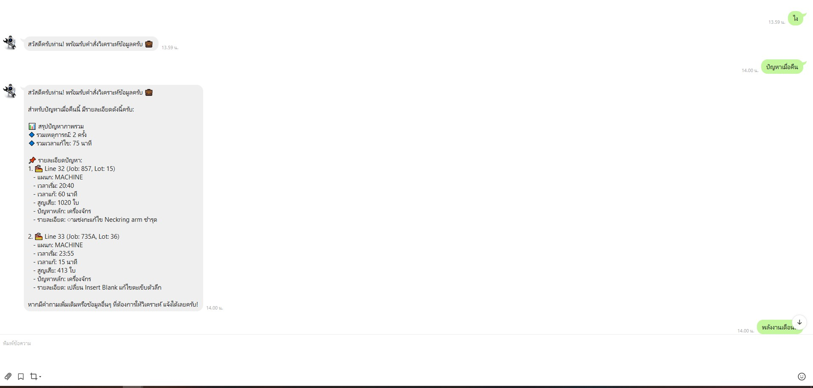
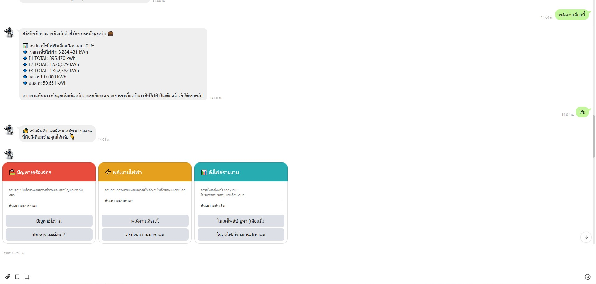

# Smart Factory LINE Chatbot 🤖
An automated assistant system integrating the **LINE Messaging API**, **Google Apps Script**, and **OpenAI (`gpt-4o-mini`)** to streamline manufacturing incident reporting and energy consumption analytics.

---

## 📸 System Overview & Preview

  
  

---

## 🌟 Key Features
* **Interactive Flex Messages:** Clean, intuitive UI allowing factory personnel to report machine breakdown issues and request energy data without typing complex commands.
* **AI-Driven Data Analytics:** Connects to OpenAI's `gpt-4o-mini` via REST API to analyze daily electricity usage, oven/furnace metrics, and breakdown logs directly from database records.
* **Cost-Effective Cloud Database:** Uses Google Sheets as a low-cost, real-time database connected via Google Apps Script.
* **Modular Code Structure:** Built with maintainability in mind, decoupling logic across dedicated script files (`Main.gs`, `Ai.gs`, `DataService.gs`, `Config.gs`, `KeywordProcessor.gs`).

---

## 🛠 Tech Stack
* **Platform:** LINE Messaging API (Flex Messages, Webhook)
* **Backend:** Google Apps Script (JavaScript)
* **AI Model:** OpenAI API (`gpt-4o-mini`)
* **Database:** Google Sheets
* **Automation:** n8n Workflow Automation

---

## 🔒 Security & Privacy Notice
*All production API keys, LINE channel access tokens, internal employee details, and specific spreadsheet database URLs have been removed and masked with placeholder values to maintain industrial data confidentiality.*
